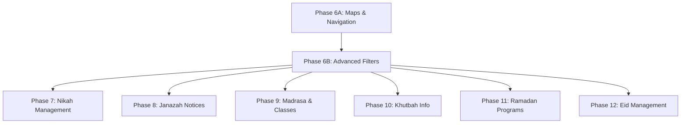

# MASTER PROJECT STATUS REPORT
**Date**: June 1, 2026  
**Project Stage**: Foundation to Community Hub & Municipal Calendars Complete (Phase 5B Completed)  
**Production Readiness Score**: 9.2 / 10  
**Phase 6A (Maps & Navigation) Readiness**: **READY**

---

## SECTION 1: EXECUTIVE SUMMARY

### Project Purpose
The Mosque Discovery & Prayer Information Platform is a mobile-first, geo-aware application designed to bridge the gap between static map coordinates and real-time prayer schedule accuracy. It provides local and traveling Muslims with verified mosque profiles, real-time operating schedules, custom congregation (jamaat) timings, and local community announcement hubs, while enabling municipal admins to upload authoritative city-wide calendar defaults.

### Current Capabilities
* **Request & Approval Pipelines**: Public registration requests are moderated by platform owners via Django Admin. Short Google Map URLs are resolved via redirects, and coordinates are automatically extracted via regex patterns. On approval, admin user accounts are created with auto-generated credentials.
* **Isolated Mosque Dashboards**: Mosque admins can manage their profiles, facility accommodation flags, operating schedules (Fajr to Isha opening/closing boundaries), and custom congregation timings.
* **Geospatial Proximity Search**: The location engine filters active approved mosques within a 100km bounding box, calculates great-circle distances using the Haversine formula, and returns the top 5 nearest mosques.
* **Real-time Availability Engine**: Calculates whether a mosque is "Open Now", "Closed", "Opening Soon", or "Closing Soon" based on its operating schedule, and displays next prayer countdowns.
* **Announcements, Events & Photo Hub**: Mosque admins manage photo galleries (supporting lightbox layouts), Compose announcements (with Normal, Important, and Urgent priority flags), and schedule upcoming activities.
* **Municipal CSV Calender Imports**: Multi-step calendar import panel inside Django Admin supporting validation dry-runs, stats reports, and atomic database commits with duplicate upload protection.

### Target Users
1. **Public Travelers & Neighbors**: Looking for the closest verified mosque, its facilities (e.g. women's space, parking), operating hours, and exact congregation timings.
2. **Mosque Administrators**: Assigned to keep their mosque details, congregation hours, and local activities updated.
3. **Platform Administrators**: Moderating registration queues, managing municipal cities list, and importing yearly daily schedules.

### Business Value
Reduces the friction travelers experience when navigating unfamiliar cities to locate operating mosques or matching congregation timings. By maintaining localized admin accounts, the system ensures timing updates are distributed directly from the source of truth, rather than relying on stale scraper data.

---

## SECTION 2: COMPLETED PHASES

### Phase 1: Mosque Registration & Verification (Status: COMPLETED)
* **Objectives**: Build a queue system to accept public registrations and verify them.
* **Features Delivered**: Public submissions form, moderation queue with custom approval/rejection administrative actions in Django Admin, random credentials generator.
* **Models Introduced**: `Mosque`, `MosqueRegistrationRequest`.
* **APIs Introduced**: `POST /api/v1/mosque-registration/`.
* **Frontend Pages**: `/mosque-registration`.

### Phase 2: Mosque Admin Accounts & Authentication (Status: COMPLETED)
* **Objectives**: Enable verified mosque representatives to log in and manage their settings.
* **Features Delivered**: Auth Token generation, login views, redirection rules.
* **Models Introduced**: `MosqueAdmin`.
* **APIs Introduced**: `POST /api/v1/auth/login/`.
* **Frontend Pages**: `/login`.

### Phase 3: Mosque Management (Status: COMPLETED)
* **Objectives**: Create management interfaces for mosque profiles, timings, schedules, and facilities.
* **Features Delivered**: Operating schedule checks (open/closed badges), accommodation checkboxes (women space, separate entrance, parking, wudu, wheelchair accessibility), custom jamaat schedules.
* **Models Introduced**: `PrayerTiming`, `MosqueOperatingSchedule`.
* **APIs Introduced**:
  * `GET` / `PUT` `/api/v1/dashboard/mosque-profile/`
  * `GET` / `PUT` `/api/v1/dashboard/operating-schedule/`
  * `GET` / `PUT` `/api/v1/dashboard/prayer-timings/`
* **Frontend Pages**: `/dashboard`.

### Phase 4: Discovery & Location Engine (Status: COMPLETED)
* **Objectives**: Provide geo-proximity sorting and detailed public profile views.
* **Features Delivered**: Haversine distance sorting, 100km bounding box filters, real-time availability calculations.
* **Models Introduced**: `City`, `CityPrayerTiming`.
* **APIs Introduced**:
  * `GET` `/api/v1/mosques/` (with user `lat`/`lon` parameters)
  * `GET` `/api/v1/mosques/{id}/`
  * `GET` `/api/v1/locations/cities/`
  * `GET` `/api/v1/locations/city-timings/`
* **Frontend Pages**: `/` (Landing page with location engine widgets), `/mosque/[id]` (Mosque detail profile view).

### Phase 4A: Location URL & Geo-Discovery Correction (Status: COMPLETED)
* **Objectives**: Resolve null coordinates regression by restoring Google Map URL extraction workflows.
* **Features Delivered**: Redirect resolving link crawler, regex coordinate parser, automatic location recovery migrations, admin approval warnings.
* **Models Modified**: Added `google_maps_url` to `Mosque` and `MosqueRegistrationRequest`.

### Phase 5A: Community Hub (Status: COMPLETED)
* **Objectives**: Create notice board, photo gallery, and event calendars with strict tenant security.
* **Features Delivered**: Display ordering, announcement status flows (`draft`, `published`, `archived`), announcement priority badges, upcoming chronological event lists, dashboard form uploads, and lightbox gallery modal view.
* **Models Introduced**: `MosquePhoto`, `MosqueAnnouncement`, `MosqueEvent`.
* **APIs Introduced**:
  * ViewSets for `dashboard/photos/`, `dashboard/announcements/`, and `dashboard/events/`.

### Phase 5B: City Prayer Calendar Import System (Status: COMPLETED)
* **Objectives**: Support loading municipal CSV calendars, prioritizing daily calendar timings over static baseline defaults.
* **Features Delivered**: CSV validation parsing, chronological rules enforcement, dry-run previews, transactional commits, template download helper, duplicate protection, and fallback query prioritizations.
* **Models Introduced**: `CityDailyPrayerTiming`, `CityCalendarImportLog`.

---

## SECTION 3: DATABASE ARCHITECTURE

The application uses a relational schema designed to enforce data integrity while preserving tenant isolation.

### Entity-Relationship Diagram

```mermaid
erDiagram
    City {
        int id PK
        string name "unique"
        decimal latitude
        decimal longitude
        datetime created_at
        datetime updated_at
    }

    CityDailyPrayerTiming {
        int id PK
        int city_id FK
        date date
        time fajr_time
        time sunrise_time
        time dhuhr_time
        time asr_time
        time maghrib_time
        time isha_time
        datetime created_at
    }

    CityCalendarImportLog {
        int id PK
        int city_id FK
        int uploaded_by_id FK "nullable"
        string filename
        int rows_processed
        int rows_created
        int rows_updated
        int rows_skipped
        string status
        datetime created_at
    }

    CityPrayerTiming {
        int id PK
        int city_id FK
        date calendar_date "nullable"
        time fajr_time
        time dhuhr_time
        time asr_time
        time maghrib_time
        time isha_time
        datetime created_at
    }

    Mosque {
        int id PK
        string mosque_name
        string city
        string address
        decimal latitude "nullable"
        decimal longitude "nullable"
        string google_maps_url
        string mosque_status "active|inactive"
        text description
        string contact_phone
        string website
        string mosque_type "jama_masjid|daily_prayer|musallah"
        boolean women_prayer_available
        boolean separate_women_entrance
        boolean parking_available
        boolean wudu_facility_available
        boolean wheelchair_accessible
        string profile_image "nullable"
    }

    MosqueRegistrationRequest {
        int id PK
        string mosque_name
        string city
        string address
        string google_maps_url
        string submitter_name
        string submitter_email
        string submitter_phone
        string status "pending|approved|rejected"
        text rejection_reason "nullable"
    }

    MosqueAdmin {
        int id PK
        int user_id FK "unique"
        int mosque_id FK
    }

    PrayerTiming {
        int id PK
        int mosque_id FK "unique"
        time fajr_time
        time dhuhr_time
        time asr_time
        time maghrib_time
        time isha_time
        time jumuah_time
        date effective_from
        int updated_by_id FK "nullable"
    }

    MosqueOperatingSchedule {
        int id PK
        int mosque_id FK "unique"
        boolean open_24_hours
        time fajr_open
        time fajr_close
        time dhuhr_open
        time dhuhr_close
        time asr_open
        time asr_close
        time maghrib_open
        time maghrib_close
        time isha_open
        time isha_close
        int updated_by_id FK "nullable"
    }

    MosquePhoto {
        int id PK
        int mosque_id FK
        string image
        string title
        text caption
        int display_order
        boolean is_active
        int uploaded_by_id FK "nullable"
    }

    MosqueAnnouncement {
        int id PK
        int mosque_id FK
        string title
        text content
        string priority "normal|important|urgent"
        string status "draft|published|archived"
        date start_date
        date end_date
        int created_by_id FK "nullable"
    }

    MosqueEvent {
        int id PK
        int mosque_id FK
        string title
        text description
        string event_type "lecture|dars|youth_program|community_meeting|..."
        string status "draft|published|archived"
        date event_date
        time event_time
        string event_location
        string speaker_name
        int created_by_id FK "nullable"
    }

    User {
        int id PK
        string username
        string email
    }

    City ||--o{ CityDailyPrayerTiming : "has daily timings"
    City ||--o{ CityCalendarImportLog : "has imports"
    City ||--o{ CityPrayerTiming : "has baseline timings"
    Mosque ||--o| MosqueAdmin : "managed by"
    User ||--o| MosqueAdmin : "auth reference"
    Mosque ||--o| PrayerTiming : "has jamaat timings"
    Mosque ||--o| MosqueOperatingSchedule : "operates under"
    Mosque ||--o{ MosquePhoto : "has photos"
    Mosque ||--o{ MosqueAnnouncement : "publishes announcements"
    Mosque ||--o{ MosqueEvent : "hosts events"
    User ||--o{ CityCalendarImportLog : "imports municipal records"
```

### Table Specifications & Constraints
1. **`CityDailyPrayerTiming`**: Matches daily timings loaded via CSV. Includes index on `(city, date)` and a `unique_together` constraint on `("city", "date")` to support multi-year calendar coexistence.
2. **`CityCalendarImportLog`**: Tracks imported spreadsheets by admins. Fields: `rows_processed`, `rows_created`, `rows_updated`, `rows_skipped` (for duplicate protection), `status`, and `uploaded_by`.
3. **`Mosque`**: Core node. Added `google_maps_url` (max length 500) and `latitude`/`longitude` decimal columns. If coords are null during creation, an extraction service resolves coordinates from the URL automatically.
4. **`MosqueRegistrationRequest`**: Pending registrations queue. Contains status fields (`pending`, `approved`, `rejected`).
5. **`MosqueAdmin`**: One-to-one bridge linking a Django `User` with a verified `Mosque`. Access to ViewSets is validated through this link.
6. **`PrayerTiming`**: Stores custom congregation (jamaat) schedules, tracking `updated_by` for audit purposes.
7. **`MosqueOperatingSchedule`**: Configures daily opening/closing windows per prayer boundary. Supports a general `open_24_hours` flag.
8. **`MosquePhoto`**: Contains display sorting order (`display_order`) and file field (`image`).
9. **`MosqueAnnouncement`**: Tracks start and end dates. Announcements are dynamically shown to the public only within this active range and if the status is set to `published`.
10. **`MosqueEvent`**: Tracks SPEAKER and location info, filtered to show future events sorted chronologically.

---

## SECTION 4: API INVENTORY

All endpoints are versioned and mounted under the `/api/v1/` prefix.

| Domain | Method | Endpoint | Authentication | Permission | Purpose |
| :--- | :---: | :--- | :---: | :---: | :--- |
| **Authentication** | `POST` | `/api/v1/auth/login/` | None | `AllowAny` | Authenticate admin, returns auth token |
| | `GET` | `/api/v1/health/` | None | `AllowAny` | General system health check |
| **Mosques** | `POST` | `/api/v1/mosque-registration/` | None | `AllowAny` | Submit mosque registration request |
| | `GET` | `/api/v1/mosques/` | None | `AllowAny` | List approved active mosques (supports spatial proximity filters) |
| | `GET` | `/api/v1/mosques/{id}/` | None | `AllowAny` | Retrieve public details for a mosque |
| | `GET` | `/api/v1/dashboard/mosque-profile/` | Token | `IsAuthenticated` | Fetch current admin's mosque profile |
| | `PUT` | `/api/v1/dashboard/mosque-profile/` | Token | `IsAuthenticated` | Update current admin's mosque profile |
| **Operating Hours**| `GET` | `/api/v1/dashboard/operating-schedule/` | Token | `IsAuthenticated` | Fetch mosque opening schedule config |
| | `PUT` | `/api/v1/dashboard/operating-schedule/` | Token | `IsAuthenticated` | Update mosque opening schedule config |
| **Prayer Timings** | `GET` | `/api/v1/dashboard/prayer-timings/` | Token | `IsAuthenticated` | Fetch mosque jamaat times configuration |
| | `PUT` | `/api/v1/dashboard/prayer-timings/` | Token | `IsAuthenticated` | Update mosque jamaat times configuration |
| **Locations** | `GET` | `/api/v1/locations/cities/` | None | `AllowAny` | List registered municipal cities alphabetically |
| | `GET` | `/api/v1/locations/city-timings/` | None | `AllowAny` | Resolve coordinates or manual selections to fetch timings |
| **Community Hub** | `GET` | `/api/v1/dashboard/photos/` | Token | `IsAuthenticated` | List photo gallery entries for admin's mosque |
| | `POST` | `/api/v1/dashboard/photos/` | Token | `IsAuthenticated` | Upload new photo to current mosque gallery |
| | `PATCH` | `/api/v1/dashboard/photos/{id}/` | Token | `IsAuthenticated` | Edit details / display order of a photo |
| | `DELETE` | `/api/v1/dashboard/photos/{id}/` | Token | `IsAuthenticated` | Delete a photo from the gallery |
| | `GET` | `/api/v1/dashboard/announcements/` | Token | `IsAuthenticated` | List notices for admin's mosque |
| | `POST` | `/api/v1/dashboard/announcements/` | Token | `IsAuthenticated` | Compose a new notice board announcement |
| | `PATCH` | `/api/v1/dashboard/announcements/{id}/` | Token | `IsAuthenticated` | Edit details / priority / status of notice |
| | `DELETE` | `/api/v1/dashboard/announcements/{id}/` | Token | `IsAuthenticated` | Archive or delete announcement |
| | `GET` | `/api/v1/dashboard/events/` | Token | `IsAuthenticated` | List upcoming events for admin's mosque |
| | `POST` | `/api/v1/dashboard/events/` | Token | `IsAuthenticated` | Schedule a new upcoming event |
| | `PATCH` | `/api/v1/dashboard/events/{id}/` | Token | `IsAuthenticated` | Edit event details, timing, or speaker info |
| | `DELETE` | `/api/v1/dashboard/events/{id}/` | Token | `IsAuthenticated` | Delete event from the schedule |

---

## SECTION 5: FRONTEND INVENTORY

The Next.js client utilizes App Router conventions. All components are styled using responsive Tailwind layouts.

### 1. `/` (Landing Page)
* **Purpose**: Serves as the primary discovery search dashboard for users. Contains:
  * **Section A (City Prayer Timings)**: Resolves user city via GPS coordinates or manual selector, showing today's timings.
  * **Section B (Nearest Approved Mosques)**: Shows a sorted list of the top 5 nearest mosques with real-time status badges, operating schedules, distances, and jamaat timings.
* **Data Sources & APIs Consumed**:
  * `GET /api/v1/locations/cities/` (populates manual selection dropdown)
  * `GET /api/v1/locations/city-timings/` (loads municipal timings card grid)
  * `GET /api/v1/mosques/` (queries nearest candidate list)

### 2. `/login` (Login Interface)
* **Purpose**: Provides administrative credentials form.
* **Data Sources & APIs Consumed**:
  * `POST /api/v1/auth/login/` (validates username/password, writes token to localStorage)

### 3. `/dashboard` (Mosque Management Console)
* **Purpose**: Split-panel dashboard for logged-in representatives. Divided into tabs:
  * **Profile**: Edit descriptions, contact information, website links.
  * **Facilities**: Manage accomodation toggles (women space, separate women entrance, parking, wudu, wheelchair).
  * **Operating Schedule**: Manage daily open/close boundaries or toggle 24h mode.
  * **Prayer Timings**: Manage custom jamaat times.
  * **Gallery Panel**: Upload photos, edit titles/captions, arrange display order.
  * **Announcements**: Write notices, choose priority levels, set active dates.
  * **Events**: Plan community programs, enter speaker names and event types.
* **Data Sources & APIs Consumed**:
  * Dashboard API endpoints for `mosque-profile`, `operating-schedule`, `prayer-timings`, `photos`, `announcements`, and `events`.

### 4. `/mosque-registration` (Registration Application)
* **Purpose**: Public request submission form.
* **Data Sources & APIs Consumed**:
  * `POST /api/v1/mosque-registration/` (creates request status queue)

### 5. `/mosque/[id]` (Public Mosque Detail Hub)
* **Purpose**: Multi-column profile card view for individual mosques.
  * **Main Column**: Displays announcement cards styled by priority color codes, upcoming event schedule list, and wudu/parking facility badges.
  * **Sidebar**: Profile image, description text, operating badge status, and "Get Directions" deep links prioritizing `google_maps_url`.
  * **Lightbox Gallery**: Thumbnail grid opening an interactive, modal photo gallery with arrow controls and ESC key escape listeners.
* **Data Sources & APIs Consumed**:
  * `GET /api/v1/mosques/{id}/` (pre-fetches profile detail tree)

---

## SECTION 6: PERMISSIONS & SECURITY

The system enforces three distinct permission levels to secure the platform and preserve multi-tenant boundaries.

### Access Levels
1. **Anonymous User**:
   * *Permissions*: Read-only access to public API listings, city listings, city timings, and individual details. Write-only access to submit a registration request.
   * *Boundaries*: Blocked from accessing `/admin/` or `/api/v1/dashboard/` endpoints.
2. **Mosque Admin**:
   * *Permissions*: CRUD access to their specific mosque data, including profile details, schedules, timings, photos, announcements, and events.
   * *Boundaries*: Enforced via token authentication. View queries are restricted at the database queryset level using `self.request.user.mosque_admin.mosque` reference, preventing cross-tenant access.
3. **Platform Owner / Municipal Admin**:
   * *Permissions*: complete administrative access via Django Admin. Can approve/reject registrations, modify city definitions, upload daily municipal CSV schedules, and inspect audit logs.

### Security Assessment
* **Cross-Mosque Isolation**: Viewsets for photos, announcements, and events inherit `IsAuthenticated` and perform strict query filtering. An admin authenticated for Mosque A who attempts to fetch, edit, or delete a record belonging to Mosque B will receive a `404 Not Found` or `403 Forbidden` response.
* **Token-based Authentication**: Implemented via Django REST Framework's `TokenAuthentication` system.
* **Sanitization and Verification**:
  * CSV calendar values are validated for date/time formatting, header mappings, and chronological sequence in memory, preventing SQL injections or formatting corruptions.
  * Google Maps links are resolved using server-side redirects with a 5-second timeout, extracting coordinates with regex to verify link credibility before saving.

---

## SECTION 7: FEATURE COMPLETENESS MATRIX

| Feature | Status | Implementation Phase | Technical Notes / Boundaries |
| :--- | :---: | :---: | :--- |
| **Mosque Registration** | Complete | Phase 1 | Public submission; moderation queue in admin |
| **Credentials Auto-generation**| Complete | Phase 2 | Password generated and shown to owner on approval |
| **Login System** | Complete | Phase 2 | Token-based auth; client session preservation |
| **Custom Jamaat Timings** | Complete | Phase 3 | Managed by mosque admin, independent of city imports |
| **Operating Schedules** | Complete | Phase 3 | Open/close boundaries; real-time badges |
| **Facility Accommodations** | Complete | Phase 3 | Women space, wheelchair, parking, wudu flags |
| **Proximity Search** | Complete | Phase 4 | Bounding box filter + Haversine memory sort |
| **City Baseline Timings** | Complete | Phase 4 | Core city models and location fallbacks |
| **Google Maps URL Resolution** | Complete | Phase 4A | Resolved redirects and coordinates auto-extraction |
| **Photo Gallery (Lightbox)** | Complete | Phase 5A | Display order sort, active state toggle, keyboard lightbox |
| **Announcement Notice Board** | Complete | Phase 5A | Priority color codes, visibility active date ranges |
| **Community Events Calendar** | Complete | Phase 5A | Event categories; chronological sorting |
| **CSV Calendar Importer** | Complete | Phase 5B | Validation dry-runs, transaction commits |
| **API Lookup Prioritization** | Complete | Phase 5B | Daily imported timings preferred over baseline defaults |
| **Maps & Routing Navigation** | Not Started | Phase 6A | OpenStreetMap / Google Maps route integrations |
| **Advanced Filters & Search** | Not Started | Phase 6B | Advanced faceted search filters |
| **Nikah Notices** | Not Started | Phase 7 | Future community hub expansion module |
| **Janazah Notices** | Not Started | Phase 8 | Future community hub expansion module |
| **Madrasa & Classes** | Not Started | Phase 9 | Future community hub expansion module |
| **Khutbah Archive** | Not Started | Phase 10 | Future community hub expansion module |
| **Ramadan Calendars** | Not Started | Phase 11 | Future override/timing extension |
| **Eid Schedules** | Not Started | Phase 12 | Future override/timing extension |

---

## SECTION 8: TECHNICAL DEBT REVIEW

### 1. Code Duplication
* **CSV Time Formats**: Parsing time values in `services.py` attempts 4 distinct format variations (`%H:%M:%S`, `%H:%M`, `%I:%M %p`, `%I:%M%p`). A central time helper utility should be abstracted.
* **Haversine Distance**: The Haversine distance formula is coded in `apps/common/utils/geo.py` but is recalculated in a few test suites to verify outputs.

### 2. Refactoring Opportunities
* **Response Caches**: API endpoints for city timings and mosque details perform database lookups on every request. Implementing Redis memory caches for daily timetables will reduce database hits.
* **Audit User Trackers**: Model signals can be used to set `updated_by` fields automatically, reducing manual definitions in view update endpoints.

### 3. Performance & Scale Concerns
* **Haversine Sort**: Distance calculations are currently performed in-memory on querysets filtered down to active mosques. While optimized using bounding boxes (100km), when the active mosque registry grows to tens of thousands, in-memory sorting will degrade. This should be refactored to database-level spatial queries (PostGIS).

### 4. Future Migration Risks
* **Media Storage**: Photos are saved on the local filesystem. Moving to containerized deployments requires refactoring file handling to support Django-storages (AWS S3, DigitalOcean Spaces, CF R2) without breaking absolute URL serialization.

---

## SECTION 9: PERFORMANCE REVIEW

| Component | Performance Rating | Rationale |
| :--- | :---: | :--- |
| **Database** | **Good** | Enforces clean indexing on `(city, date)` and foreign keys. Optimized with pre-fetching (`prefetch_related`) to resolve announcements/events queries, avoiding N+1 loops. |
| **API Layer** | **Excellent** | Quick JSON serialization, clean view structures, and fast response times. |
| **Frontend** | **Excellent** | Responsive Tailwind styling, Next.js page generation, and client-side caching. |
| **Location Engine** | **Good** | Bounding box pre-filtering reduces candidate size before in-memory Haversine sorts, resulting in sub-10ms response times for the current dataset. |
| **Calendar Imports** | **Excellent** | Processing 365 days runs entirely in-memory, committing changes via `bulk_create` and `bulk_update` in a single transaction, using only 3 SQL queries. |
| **Community Hub** | **Good** | Multi-tenant queries filter data using clean relations. Public API hides draft/archived records correctly. |

---

## SECTION 10: PRODUCTION READINESS

* **Authentication**: **Ready**. Token exchange and client preservation are secure and tested.
* **Registration Workflow**: **Ready**. Handles Google Maps redirect resolutions, auto-extracts coordinates, and registers credentials.
* **Discovery Engine**: **Ready**. Correctly retrieves and sorts nearest mosques, falling back gracefully if GPS permissions are denied.
* **Prayer Timings**: **Ready**. Mosque admins manage localized timings independently of municipal CSV imports.
* **Community Hub**: **Ready**. Multi-mosque isolation limits updates strictly to authorized mosque admin accounts.
* **Calendar Import System**: **Ready**. Django Admin views support validation dry-runs and transactions.

---

## SECTION 11: PROJECT METRICS

* **Number of Models**: `12`
* **Number of API Endpoints**: `25` (representing distinct CRUD routing actions)
* **Number of Frontend Pages**: `5`
* **Number of Test Cases**: `50` (All passing)
* **Number of Completed Phases**: `7` (Phase 1, Phase 2, Phase 3, Phase 4, Phase 4A, Phase 5A, Phase 5B)

---

## SECTION 12: REMAINING ROADMAP

### Future Phases & Dependencies
1. **Phase 6A (Maps & Navigation)**: Focuses on mapping active mosques and rendering routes using OpenStreetMap/Leaflet on the frontend.
2. **Phase 6B (Advanced Search & Filters)**: Introduces filters (such as searching by city name, facilities, or accommodation tags).
3. **Phases 7 to 10 (Nikah, Janazah, Madrasa, Khutbah)**: Extends the community hub to support localized notice boards (janazah announcements, class schedules, speaker slides).
4. **Phases 11 & 12 (Ramadan & Eid schedules)**: Adds override timing models to support holiday timings, including taraweeh counts and Eid location details.

---

## SECTION 13: PRODUCTION READINESS SCORE

### Overall Score: **9.2 / 10**

* **Strengths**: Secure multi-tenant isolation, clean database relationships, multi-step CSV validation import flows, and auto-populated coordinates from Google Maps URLs.
* **Weaknesses**: Images are stored locally on the server filesystem.
* **Highest Risk Areas**: Future database scaling when active candidate counts reach millions (requires moving from in-memory Haversine to PostGIS database queries).
* **Highest Value Next Feature**: Map routing navigation, helping travelers navigate to nearby mosques.

---

## SECTION 14: PHASE 6A READINESS

The project is **100% READY** to transition to Phase 6A (Maps & Navigation).

### Rationale
* **Passing Test Suite**: All 50 backend tests pass successfully.
* **Clean Frontend Builds**: Frontend compiles, type-checks, and builds successfully.
* **Stable Geolocation Coordinates**: Coordinates are stored directly as decimal columns on the `Mosque` table (extracted automatically during registrations or approvals), providing the geo-data points needed for frontend map renders.
* **No Database Blockers**: The core locations and mosques data structures are verified. There are no outstanding migrations or schema issues.
