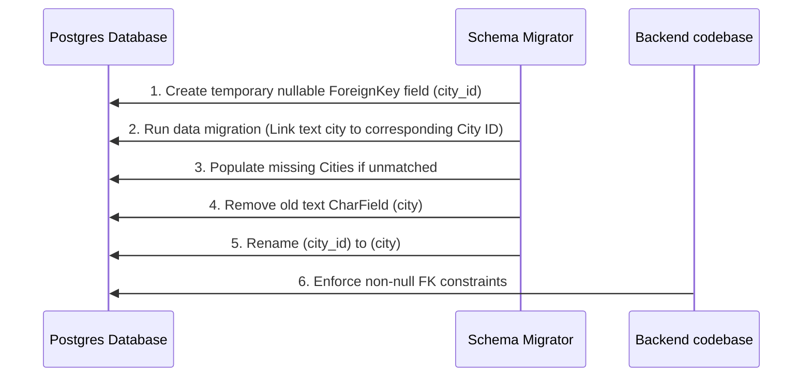

# Phase 7 Foundation Review: City Relationship Normalization

This document evaluates the database schema relationships, focusing on the configuration of the `city` field on the `Mosque` model and outlining the requirements for the Phase 7 normalization refactor.

---

## 1. Current Database Relationship Audit

An inspection of the model structures reveals:
* **`Mosque.city`**: Defined as a text-based CharField:
  ```python
  city = models.CharField(max_length=120, blank=True)
  ```
* **`City`**: Defined as an independent model containing coordinates and timezone settings:
  ```python
  class City(TimeStampedModel):
      name = models.CharField(max_length=100, unique=True)
      timezone = models.CharField(max_length=50, default="Asia/Kolkata")
  ```

### Why it was built this way initially
To simplify initial mosque registrations without requiring a pre-populated city database.

---

## 2. Rationale for the Phase 7 Foundation Refactor

Leaving `Mosque.city` as a CharField presents structural issues:

### A. Integrity Deficit & Silent Timezone Failures
* Timezone resolution uses the lowercase string key:
  ```python
  City.objects.filter(name__iexact=city_name).first()
  ```
* If an administrator inputs a typo (e.g. "Dubaai" instead of "Dubai") or includes trailing characters, the lookup will fail to match any registered city.
* The availability engine defaults to `'Asia/Kolkata'` (Indian Standard Time) for unresolved lookups. This causes silent failures where incorrect operational states are calculated for overseas mosques.

### B. ORM Join Obstacles
* Django cannot execute SQL joins on non-relational fields, making `select_related("city")` throw exceptions.
* Normalizing to a ForeignKey allows Django to perform relational joins (`select_related("city")`), making the static cache in `MosqueAvailabilityEngine` obsolete.

---

## 3. Benefits of Normalization

* **Guaranteed Referential Integrity**: Prevents orphan or misspelt city entries.
* **Curated Administrative UI**: Simplifies the registration request flow, replacing text boxes with dropdown selections on the frontend.
* **Relational Query Support**: Enables database joins (`select_related("city")`) and simplifies distance sorting logic.

---

## 4. Migration Complexity & Implementation Steps

This is a **Medium Complexity** refactor. It must be performed in sequential stages:



### Step 1: Schema Adjustments
1. Add `city_id` as a nullable ForeignKey field to `Mosque`.

### Step 2: Data Migration
1. Write a custom data migration to loop through all `Mosque` entries.
2. Resolve the matching `City` record. If no match is found, create a new `City` entry using default coordinates.
3. Link the ForeignKey reference.

### Step 3: Cleanup
1. Delete the old `city` CharField.
2. Rename the `city_id` ForeignKey field to `city`.
3. Set `null=False` on the field.

### Step 4: Code & Serializer Update
1. Update `MosqueSerializer` and forms to validate the ForeignKey relationship.
2. Update the frontend registration page and dashboard panels to select from the `/api/v1/locations/cities/` endpoint.
