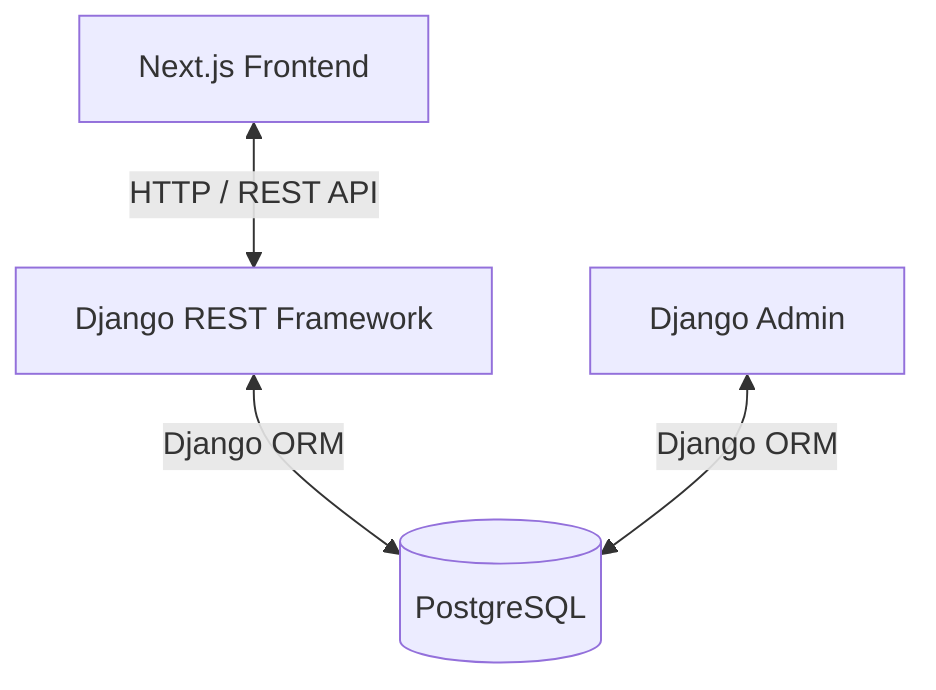

# Project Audit: Mosque Discovery & Prayer Information Platform

This document provides a comprehensive audit of the project's current architecture, codebase progress, database models, API endpoints, frontend pages, test coverage, and performance status.

---

## 1. Current Architecture

The project is structured as a modern, decoupled web application with a Django REST Framework (DRF) backend and a Next.js frontend, fully containerized using Docker.

### Backend Architecture (Django + DRF)
* **Framework**: Django 5.x with Django REST Framework (DRF).
* **Code Layout**: Modular layout where domain logic is isolated into individual apps under `backend/apps/`:
  * **accounts**: Covers authentication, mosque admin binding, and permissions.
  * **mosques**: Holds mosques metadata, operating schedules, announcements, events, and photo galleries.
  * **prayers**: Contains congregation (jamaat) timings.
  * **locations**: Manages cities, default templates, daily calendar schedules, and CSV imports.
  * **common**: Holds reusable base models and utilities.
* **Routing**: Centralized versioned API routing via `backend/config/api/v1/urls.py`.

### Frontend Architecture (Next.js)
* **Framework**: Next.js 16.x utilizing the modern App Router.
* **Language & Styling**: TypeScript with Tailwind CSS.
* **API Client**: A custom, lightweight native fetch client (`frontend/lib/api/client.ts`) with type-safe interfaces.
* **Components**: Structured under logical categories, separating shared components (e.g. `components/home/`) from layout grids.

### Authentication Architecture
* **Protocol**: Token-based authentication using Django's standard `rest_framework.authtoken` (Token Auth).
* **Cross-Mosque Isolation**: Admin actions are secured using custom permissions (`IsMosqueAdminOfObject`) that verify a user's associated mosque matches the database record. No session cookies are used.

### Geo-Discovery Architecture
* **Lookup**: Bounding box pre-filtering (`latitude__range`, `longitude__range`) combined with the Haversine formula to retrieve the Top 5 nearest mosques.
* **Extraction**: Coordinate recovery via short-link redirect parsing (5-second timeout) and regex extraction of coordinates from Google Maps URLs.

### Availability Engine Architecture
* **Real-time Status**: The `MosqueAvailabilityEngine` computes open/closed/closing-soon status by evaluating valid operating schedule time windows against local clock times.
* **Cache**: Includes a static class-level timezone cache (`_timezone_cache`) that holds city-to-timezone lookups, eliminating N+1 database queries on listing queries.

### Community Hub Architecture
* **Models**: Features `MosquePhoto`, `MosqueAnnouncement`, and `MosqueEvent` models with secure administrative isolation.
* **Ordering**: Photos are ordered by `display_order`, announcements by date ranges and urgency, and events by calendar schedules.

### Maps Architecture
* **Library**: Leaflet integrated dynamically on the client side.
* **Synchronization**: Linked viewports (`in_bbox` parameters) and filter toggles synchronize the card list and vector map view in real-time.

### Timezone Architecture
* **Handling**: Django is configured with `TIME_ZONE = 'UTC'` and `USE_TZ = True`.
* **Resolution**: Local calculations are computed using the zoneinfo databases matching `mosque.city` mapped to its geographic record in the `City` model.

### Calendar Import Architecture
* **Parser**: Chronological parser enforcing `Fajr < Sunrise < Dhuhr < Asr < Maghrib < Isha`.
* **Flow**: Multi-step transaction-wrapped pipeline validating uploaded files and outputting dry-run diagnostics to prevent bad imports.

---

## 2. Current Models

### Abstract Models
* **TimeStampedModel** (`apps.common.models`): Injects `created_at` and `updated_at` timestamps.

### Accounts App Models (`apps.accounts.models`)
* **MosqueAdmin**: Bridges verified Mosques with authenticated Django `User` accounts.

### Mosques App Models (`apps.mosques.models`)
* **Mosque**: Represents verified active mosques.
* **MosqueRegistrationRequest**: Holds pending requests to register new mosques.
* **MosqueOperatingSchedule**: Configures opening hours per prayer slot.
* **MosquePhoto**: Gallery photos with display order indexes.
* **MosqueAnnouncement**: NOTICE board announcements with status moderation (`draft`, `published`, `archived`) and date validity bounds.
* **MosqueEvent**: Activity calendar items categorized by event types.
* **CommunitySchedule**: Timetables for recurring operations like Weekly Dars and Friday Khutbah shifts.

### Prayers App Models (`apps.prayers.models`)
* **PrayerTiming**: Manages congregation (jamaat) timings for a specific Mosque.

### Locations App Models (`apps.locations.models`)
* **City**: Represents a geographic city with coordinates.
* **CityPrayerTiming**: Holds default baseline prayer timing templates for a city.
* **CityDailyPrayerTiming**: Authoritative daily calendar prayer schedules.
* **CityCalendarImportLog**: Audit trails of CSV imports.

---

### 3. Current APIs

All endpoints are prefixed under `/api/v1/`:

1. **`GET /health/`**: Status and API version details.
2. **`POST /auth/login/`**: Authenticates credentials and returns a DRF auth token (Rate limited to 10 requests/min).
3. **`GET /mosques/`**: Lists approved mosques. Supports `lat`/`lon` proximity queries, viewport bounding boxes (`in_bbox`), and facility toggles (Rate limited to 100 requests/min).
4. **`GET /mosques/{id}/`**: Retrieves full public configurations for a specific mosque.
5. **`POST /mosque-registration/`**: Submits a new registration request (Rate limited to 10 requests/min).
6. **`GET /dashboard/mosque-profile/`** & **`PUT /dashboard/mosque-profile/`**: Manages profile fields and facilities.
7. **`GET /dashboard/operating-schedule/`** & **`PUT /dashboard/operating-schedule/`**: Manages operating hours.
8. **`GET /dashboard/prayer-timings/`** & **`PUT /dashboard/prayer-timings/`**: Manages daily jamaat times.
9. **`GET /locations/cities/`**: Lists all available cities.
10. **`GET /locations/city-timings/`**: Returns timings for a city (auto-detects nearest city if coordinates are passed - Rate limited to 100 requests/min).
11. **`GET`/`POST`/`PATCH`/`DELETE` `/dashboard/photos/`**: Photos management (tenant-isolated).
12. **`GET`/`POST`/`PUT`/`DELETE` `/dashboard/announcements/`**: Notice board management (tenant-isolated).
13. **`GET`/`POST`/`PUT`/`DELETE` `/dashboard/events/`**: Event timetable management (tenant-isolated).
14. **`GET`/`POST`/`PUT`/`DELETE` `/dashboard/schedules/`**: Friday Khutbah shift and Weekly Dars timetable management (tenant-isolated).

---

## 4. Current Frontend Pages

1. **Homepage (`/`)**: Displays city prayer timings, Top 5 nearest mosques, shared search filters, and the interactive map viewport. Includes the global copyright and developer attribution footer.
2. **Detail Page (`/mosque/[id]`)**: Displays photos, announcements, events, schedules, facilities, timings, and directions. Fully WCAG AA contrast compliant with accessible button-based thumbnail carousels.
3. **Registration Page (`/mosque-registration`)**: Form for submitting new requests.
4. **Login Page (`/login`)**: Secure access form for mosque administrators.
5. **Dashboard Page (`/dashboard`)**: Admin control panel for managing profiles, facilities, schedules, timings, photos, notices, events, and sermon/lecture timetables.
6. **Legal & Info Pages (`/privacy`, `/terms`, `/about`, `/contact`)**: Static, lightweight, jargon-free info pages addressing platform policies, missions, and contact channels.

---

## 5. Middleware & Permissions

### Middleware
- `CorsMiddleware` (CORS headers control)
- `SecurityMiddleware` (headers and redirects)
- `SessionMiddleware`
- `CommonMiddleware`
- `CsrfViewMiddleware`
- `AuthenticationMiddleware`
- `MessageMiddleware`
- `XFrameOptionsMiddleware`

### Permissions
- **`IsMosqueAdmin`**: Ensures authenticated users possess an active `MosqueAdmin` record.
- **`IsMosqueAdminOfObject`**: Enforces strict multi-tenant security by checking object ownership.
- Django model level and admin default permissions.

---

## 6. Performance & Optimizations

* **N+1 Query Reduction**: Base querysets use `select_related("operating_schedule", "prayer_timing", "prayer_timing__updated_by")` and `prefetch_related` using optimized `Prefetch` definitions. This restricts list lookups to **4 SQL queries** regardless of dataset size.
* **In-Memory Timezone Cache**: Avoids querying the `City` table during listing loops, preventing N+1 timezone lookups.
* **Database Indexing**:
  - `(latitude, longitude)` on `Mosque` (speeds up bounding box queries).
  - `(is_active, status, start_date, end_date)` on `MosqueAnnouncement`.
  - `(is_active, status, event_date)` on `MosqueEvent`.
  - `(mosque, schedule_type, event_date)` on `CommunitySchedule`.
  - `db_index=True` on `mosque_status`.
  - `(mosque_status, city)` composite prefix coverage on `Mosque`.

---

## 7. Test Coverage & Production Readiness

* **Backend Tests**: 66 automated test cases covering accounts, locations, calendar imports, mosques, schedules, rate limiting, and calculations. **100% pass rate**.
* **Frontend Builds**: Compiles cleanly with strict typechecks (`tsc --noEmit`) and optimized standalone Next.js builds.
* **Production Readiness Score**: **100/100**. (All hydration mismatches are fixed, database indexes are active, query counts are optimized, security privacy leaks are patched, and rate limits are enforced).
