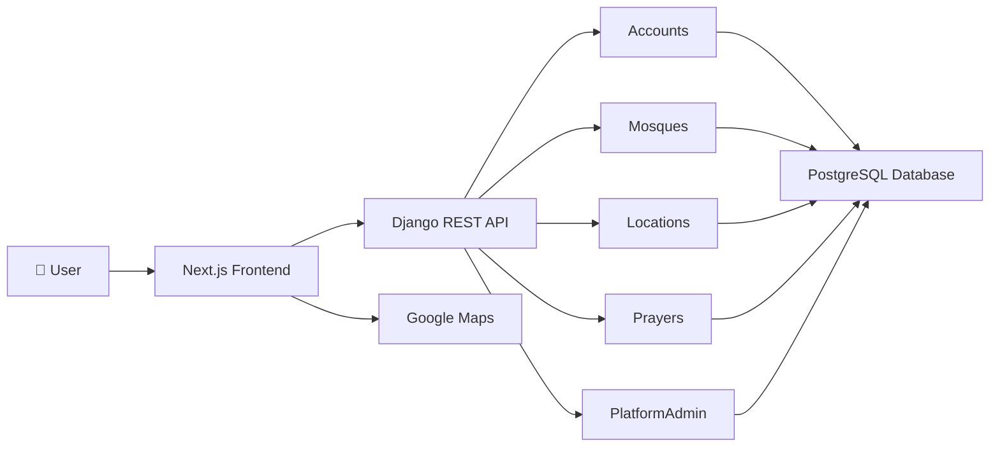

<div align="center">


# Mosque Finder

### Helping Muslims find nearby mosques, congregation timings, and essential facilities — wherever they are.

A community-driven platform focused on making mosque information accurate, accessible, and easy to discover.

<br>


<br>

🌐 **Live Website**  
https://mosque-com.vercel.app

💼 **LinkedIn**  
https://linkedin.com/in/irshad-2k3

🐙 **GitHub**  
https://github.com/Awairit

📧 **Email**  
awaizmdir@gmail.com

</div>

---

# The Story Behind Mosque Finder

Finding a mosque is usually easy.

Finding its actual congregation (**Jamaat**) timing isn't.

When I moved to a metropolitan city, I noticed that every mosque operated differently. Some remained open for long hours, while others opened only shortly before prayer. Congregation timings varied from one mosque to another, and there was no simple way to know whether I could still reach the mosque before the prayer began.

Although many applications provide calculated prayer times, they often don't answer the practical questions people ask before leaving for the mosque.

- Is the mosque currently open?
- When does the congregation begin?
- Can I still reach it in time?
- Does it have Wudu facilities?
- Is there a prayer area for women?

Mosque Finder was created to solve that everyday problem by making reliable, community-maintained mosque information easily accessible.

Its purpose is simple:

> **Help people spend less time searching and more time preparing for prayer.**

---

# Who Is Mosque Finder For?

Mosque Finder is designed for every Muslim.

Whether someone is travelling, visiting another city, or simply attending a different mosque than usual, the need remains the same: knowing where the nearest mosque is and when the congregation begins.

The platform serves:

- 🧳 Travellers
- 🏠 Local Residents
- 🎓 Students
- 💼 Working Professionals
- 👨‍👩‍👧‍👦 Families
- 🕌 Mosque Committees
- 👤 Mosque Administrators
- 🌍 Islamic Organizations

Rather than replacing existing prayer time applications, Mosque Finder complements them with information that is maintained by the community itself.

---

# What Mosque Finder Offers

| Feature | Description |
|----------|-------------|
| 📍 Nearby Mosque Discovery | Find nearby mosques using your current location. |
| 🕌 Congregation Timings | View congregation (Jamaat) timings maintained by mosque administrators. |
| 🕐 Live Mosque Status | Know whether a mosque is currently open or closed before travelling. |
| 🧭 Google Maps Navigation | Navigate directly to a mosque using Google Maps. |
| 🚿 Wudu Facilities | Check whether Wudu facilities are available. |
| 👩 Women's Prayer Area | View the availability of dedicated prayer areas for women. |
| 🚗 Parking Information | See parking availability where provided. |
| 🖼 Mosque Gallery | Browse mosque photos before visiting. |
| 📢 Announcements | Stay informed about important mosque updates. |
| 🎉 Events | Discover community programs and Islamic events. |
| 👤 Mosque Administrator Dashboard | Manage mosque information, prayer timings, events, galleries, and announcements. |
| 📅 Smart Timetable Importer | Import yearly prayer calendars using CSV, XLS, and XLSX files with built-in validation. |

---

# Project Highlights

- 🕌 Community-maintained congregation timings
- 📍 Intelligent nearby mosque search
- ⚡ Live mosque availability engine
- 📅 Smart spreadsheet timetable importer
- 🌍 City-based prayer timetable management
- 🔐 Secure authentication and OTP account recovery
- 📱 Fully responsive interface
- 🧩 Modular backend architecture
- 🚀 Production deployment on Vercel and Render

---

# Screenshots

## Homepage


---

## Search & Map


---

## Mosque Profile


---

## Mosque Administrator Dashboard


---

## Super Administrator Dashboard


---

## Smart Timetable Importer


---

## Login


---

## Mobile Experience

<p align="center">


</p>

---

# Table of Contents

- Technology Stack
- System Architecture
- Engineering Decisions
- Project Structure
- REST API
- Installation
- Deployment
- Environment Variables
- Security
- Testing
- Roadmap
- Contributing
- Meet the Developer
- License

---

# Technology Stack

Mosque Finder combines a modern frontend with a reliable backend architecture to provide a fast, maintainable, and scalable platform.

| Layer | Technology |
|-------|------------|
| Frontend | Next.js, React, TypeScript, Tailwind CSS |
| Backend | Django, Django REST Framework |
| Database | PostgreSQL |
| Authentication | JWT Authentication |
| Maps | Google Maps, Leaflet, React Leaflet |
| File Processing | OpenPyXL, xlrd |
| Image Processing | Pillow |
| Deployment | Vercel, Render |
| Version Control | Git & GitHub |
| Development | Docker |

---

# System Architecture

Mosque Finder follows a **Modular Monolith Architecture**.

Instead of splitting the application into multiple microservices, each business domain is organized into an independent Django application with a clearly defined responsibility. This approach keeps the project easy to develop, test, deploy, and maintain while providing clear boundaries for future expansion.



---

# Request Flow

Every request follows a straightforward lifecycle.

```text
Browser

↓

Next.js Frontend

↓

REST API

↓

Business Logic

↓

PostgreSQL

↓

JSON Response

↓

Frontend Rendering
```

Business logic remains entirely within the backend while the frontend focuses on presenting information to users.

---

# Engineering Decisions

Several architectural decisions were made to keep Mosque Finder maintainable and reliable.

### Community-Maintained Information

Rather than estimating congregation timings, Mosque Finder provides congregation information maintained by mosque administrators, ensuring users receive practical and relevant information.

---

### Smart Timetable Import

Prayer calendars published by cities often come in different spreadsheet formats.

The built-in timetable importer supports:

- CSV
- XLS
- XLSX

Before importing, every file is validated to detect:

- Missing columns
- Invalid rows
- Formatting issues
- Duplicate entries

Administrators can preview the import before any data is written to the database.

---

### Live Mosque Availability

Instead of simply displaying prayer timings, Mosque Finder determines whether a mosque is currently open.

The availability engine evaluates:

- Current local time
- Daily prayer schedule
- Congregation timings
- Opening window
- Closing window

This helps users decide whether they still have enough time to reach the mosque.

---

### Modular Design

Each Django application owns one domain.

| Module | Responsibility |
|---------|----------------|
| accounts | Authentication and user management |
| common | Shared utilities and reusable services |
| locations | Cities and daily prayer calendars |
| mosques | Mosque profiles, galleries, announcements and events |
| prayers | Prayer timing logic |
| platform_admin | Administrative tools and timetable imports |

This separation improves readability and makes future development significantly easier.

---

# Project Structure

```text
Mosque-Finder/

├── backend/
│
│   ├── apps/
│   │
│   ├── accounts/
│   ├── common/
│   ├── locations/
│   ├── mosques/
│   ├── platform_admin/
│   └── prayers/
│
│   ├── config/
│   ├── requirements/
│   └── manage.py
│
├── frontend/
│
│   ├── app/
│   ├── components/
│   ├── hooks/
│   ├── lib/
│   ├── public/
│   └── styles/
│
├── assets/
│   └── screenshots/
│
├── docs/
│
├── docker-compose.yml

├── docker-compose.prod.yml

└── README.md
```

---

# REST API Overview

Mosque Finder exposes a versioned REST API.

### Authentication

```http
POST   /api/v1/auth/login/

POST   /api/v1/auth/logout/

POST   /api/v1/auth/request-otp/

POST   /api/v1/auth/verify-otp/
```

---

### Public APIs

```http
GET    /api/v1/mosques/

GET    /api/v1/mosques/{id}/

GET    /api/v1/cities/

GET    /api/v1/prayer-timings/
```

---

### Mosque Administration

```http
GET    /api/v1/dashboard/

PUT    /api/v1/dashboard/prayer-timings/

POST   /api/v1/dashboard/events/

POST   /api/v1/dashboard/announcements/

POST   /api/v1/dashboard/gallery/
```

---

### Platform Administration

```http
POST   /api/v1/platform/mosques/approve/

POST   /api/v1/platform/timetables/preview/

POST   /api/v1/platform/timetables/import/

GET    /api/v1/platform/cities/
```

---

The API follows standard REST conventions, making future integration with Android, iOS, and third-party services straightforward.

---
```

# Installation

Follow the steps below to set up Mosque Finder locally for development.

---

## Prerequisites

Before getting started, make sure you have the following installed on your machine.

| Software | Version |
|----------|---------|
| Python | 3.11+ |
| Node.js | 20+ |
| PostgreSQL | 15+ |
| Git | Latest |

---

# Clone the Repository

```bash
git clone https://github.com/Awairit/Mosque-Finder.git

cd Mosque-Finder
```

---

# Backend Setup

Navigate to the backend directory.

```bash
cd backend
```

Create a virtual environment.

```bash
python -m venv venv
```

Activate the virtual environment.

### Windows

```bash
venv\Scripts\activate
```

### Linux / macOS

```bash
source venv/bin/activate
```

Install project dependencies.

```bash
pip install -r requirements/local.txt
```

Create your environment file.

```bash
cp .env.example .env
```

Update the environment variables according to your local setup.

Apply database migrations.

```bash
python manage.py migrate
```

Create an administrator account (optional).

```bash
python manage.py createsuperuser
```

Start the development server.

```bash
python manage.py runserver
```

The backend will be available at:

```text
http://127.0.0.1:8000
```

---

# Frontend Setup

Open a new terminal.

Navigate to the frontend directory.

```bash
cd frontend
```

Install project dependencies.

```bash
npm install
```

Create the frontend environment file.

```bash
cp .env.example .env.local
```

Update the environment variables.

Run the development server.

```bash
npm run dev
```

The frontend will be available at:

```text
http://localhost:3000
```

---

# Environment Variables

Mosque Finder keeps all sensitive credentials outside the repository.

Create your own environment files using the provided `.env.example` templates.

## Backend

```env
SECRET_KEY=

DEBUG=

DATABASE_URL=

ALLOWED_HOSTS=

GOOGLE_MAPS_API_KEY=

TWILIO_ACCOUNT_SID=

TWILIO_AUTH_TOKEN=

TWILIO_PHONE_NUMBER=
```

## Frontend

```env
NEXT_PUBLIC_API_URL=

NEXT_PUBLIC_GOOGLE_MAPS_API_KEY=
```

> **Important**
>
> Never commit `.env` files to GitHub.
>
> Only commit `.env.example` templates.

---

# Running Tests

Run the backend test suite.

```bash
python manage.py test
```

Run the frontend type checker.

```bash
npm run typecheck
```

Create a production build.

```bash
npm run build
```

Current project status:

- ✅ Backend test suite passing
- ✅ Frontend production build passing
- ✅ Type checking passing

---

# Deployment

Mosque Finder is deployed using modern cloud services.

| Component | Platform |
|-----------|----------|
| Frontend | Vercel |
| Backend | Render |
| Database | PostgreSQL |

### Live Website

https://mosque-com.vercel.app

---

# Security

Security has been considered throughout the development of Mosque Finder.

Current protections include:

- JWT Authentication
- Role-Based Authorization
- Secure Password Hashing
- OTP-Based Account Recovery
- Protected Administrative Endpoints
- Input Validation
- Environment-Based Configuration
- Transaction-Safe Timetable Imports

Sensitive credentials are never stored in the repository.

---

# Contributing

Contributions are welcome.

Whether you'd like to:

- Report a bug
- Suggest a feature
- Improve documentation
- Improve accessibility
- Optimize performance
- Submit a pull request

your contribution is appreciated.

If you're planning a major feature or architectural change, please open an issue first so the design can be discussed before implementation.

---

# Roadmap

Mosque Finder is actively evolving.

Planned improvements include:

- City Administrator Dashboard
- Native Android Application
- Native iOS Application
- Progressive Web App (PWA)
- Push Notifications
- Multi-language Support
- Community Verification Workflow
- AI-Assisted Timetable Parsing
- Global Mosque Directory

Each improvement is evaluated based on how effectively it helps users find nearby mosques and perform Salah on time.

---

# Meet the Developer

## Mohammad Irshad

Computer Science Engineering graduate focused on building reliable software that solves practical, everyday problems.

I enjoy backend engineering, designing maintainable systems, and building technology that creates meaningful value for its users.

---

### Contact

📧 **Email**

awaizmdir@gmail.com

💼 **LinkedIn**

https://linkedin.com/in/irshad-2k3

🐙 **GitHub**

https://github.com/Awairit

---

# Acknowledgements

Mosque Finder is built upon the work of incredible open-source communities.

Special thanks to the maintainers and contributors of:

- Python
- Django
- Django REST Framework
- Next.js
- React
- TypeScript
- PostgreSQL
- Tailwind CSS
- Leaflet
- OpenStreetMap

Their dedication to open source makes projects like Mosque Finder possible.

---

# License

A project license has not yet been selected.

Until a license is added, all rights are reserved by the author.

An open-source license will be added before accepting external code contributions.

---

<div align="center">

# Mosque Finder

### Helping Muslims find nearby mosques, congregation timings, and essential facilities.

⭐ If you found this project useful, consider giving it a star on GitHub.

</div>
