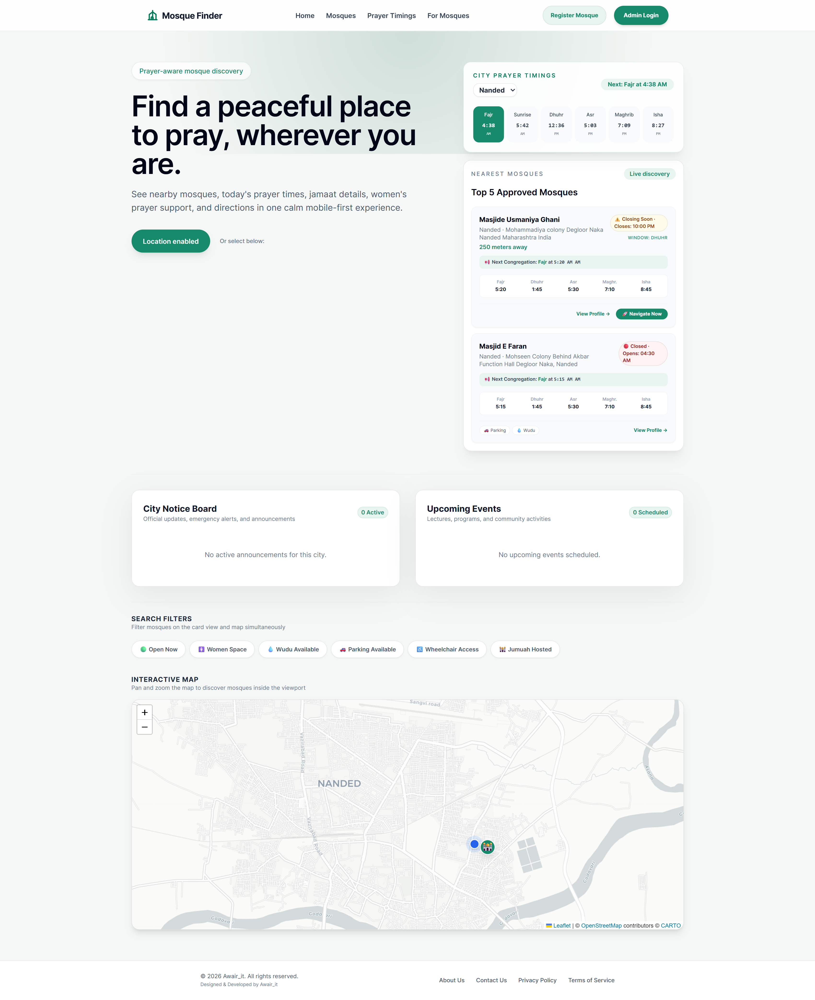
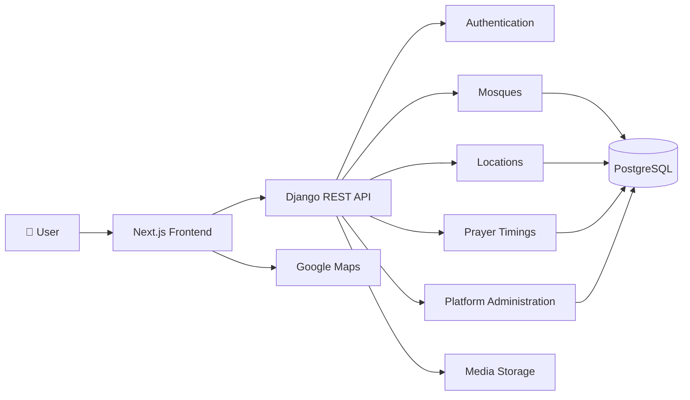

<div align="center">


# Mosque Finder

### Helping Muslims find nearby mosques and pray on time.

A community-driven platform that helps Muslims discover nearby mosques, view accurate congregation (Jamaat) timings, check mosque availability, and access essential facilities wherever they are.

<br>


<br>

<a href="YOUR_VERCEL_LINK">

</a>

<a href="https://github.com/Awairit">

</a>

<a href="https://linkedin.com/in/irshad-2k3">

</a>

</div>

---

# Why Mosque Finder Exists

Every Muslim is required to perform the five daily prayers on time. While prayer times themselves are widely available, finding the **actual congregation (Jamaat) time** at a nearby mosque is often much more difficult than it should be.

This challenge becomes even more noticeable when travelling, moving to a new city, or visiting an unfamiliar area.

Different mosques often follow different congregation schedules.

Some remain open throughout the day.

Some open only shortly before prayer.

Facilities such as Wudu areas, women's prayer spaces, parking availability, and community announcements are rarely available in one reliable place.

Mosque Finder was created to solve that problem.

Instead of estimating prayer schedules, Mosque Finder provides community-managed congregation information that helps people know:

- Which mosque is nearest
- Whether it is currently open
- When the next congregation begins
- Whether they can reach it on time
- What facilities are available before they arrive

The objective is intentionally simple:

> **Help people spend less time searching and more time praying.**

---

# Design Philosophy

Mosque Finder is intentionally designed around a single principle:

> **Solve one problem exceptionally well instead of solving many problems poorly.**

Rather than becoming an all-in-one Islamic application, Mosque Finder focuses on providing accurate and reliable mosque information that people need every day.

Every feature added to the platform must answer one simple question:

> **Does this genuinely help someone find a mosque and perform Salah on time?**

If the answer is no, it probably doesn't belong.

---

# Core Principles

- Accuracy over assumptions.
- Reliability over complexity.
- Community over convenience.
- Purpose over trends.
- Build for long-term sustainability.
- Design around real needs.
- Keep the experience simple and fast.

---

# Live Project

| Service | Status |
|----------|--------|
| 🌐 Frontend | **YOUR VERCEL URL** |
| ⚙ Backend API | **YOUR RENDER URL** |
| 📖 API Documentation | Coming Soon |

---

# Project Showcase

## Homepage



---

## Search & Map View


---

## Mosque Details


---

## Mosque Admin Dashboard


---

## Super Admin Dashboard


---

## Spreadsheet Timetable Import


---

## Login


---

## Mobile Experience

<p align="center">


</p>

---

# Features

Mosque Finder is designed around three primary user groups, each with tools tailored to their responsibilities.

---

## 🕌 For Everyone

Helping Muslims quickly find the right mosque and pray on time.

| Feature | Description |
|----------|-------------|
| 📍 Nearby Mosque Discovery | Find nearby mosques based on your current location. |
| 🕌 Congregation (Jamaat) Timings | View actual mosque congregation timings instead of only calculated prayer times. |
| 🕐 Live Mosque Status | Instantly see whether a mosque is currently open or closed. |
| 🧭 Google Maps Integration | Navigate directly to the selected mosque. |
| 🚿 Wudu Facilities | Know whether Wudu facilities are available before arriving. |
| 👩 Women's Prayer Area | Check if dedicated facilities are available for women. |
| 🚗 Parking Information | View available parking facilities where provided. |
| 📢 Announcements | Receive updates shared by mosque administrators. |
| 🎉 Events | View community programs and upcoming events. |
| 🖼 Mosque Gallery | Browse photos of the mosque before visiting. |
| 📱 Responsive Design | Optimized for desktop, tablet, and mobile devices. |

---

## 👤 Mosque Administrator

Mosque administrators maintain information for their own mosque without requiring technical knowledge.

| Feature | Description |
|----------|-------------|
| 🕌 Mosque Dashboard | Manage mosque information from a dedicated dashboard. |
| 🕐 Prayer Timing Management | Update congregation timings whenever required. |
| 🖼 Gallery Management | Upload and organize mosque photographs. |
| 📢 Announcement Management | Publish important community announcements. |
| 🎉 Event Management | Create and manage mosque events. |
| 📍 Location Verification | Verify and update mosque location information. |
| 📈 Dashboard Overview | View current mosque information in one place. |
| 🔐 Secure Authentication | Protected administrator login with OTP-based account recovery. |

---

## 🌍 Platform Administration

Designed for managing the platform at city and national scale.

| Feature | Description |
|----------|-------------|
| ✅ Mosque Approval Workflow | Review and approve newly submitted mosque registrations. |
| 🌆 City Management | Create and maintain supported cities. |
| 📅 Smart Timetable Importer | Import yearly prayer calendars using CSV, XLS, or XLSX files. |
| 🔄 Merge & Replace Import | Choose whether imported calendars replace or merge with existing data. |
| 📊 Preview Before Import | Validate imported files before any database changes occur. |
| ⚠ Validation Reports | Detect invalid rows, missing columns, incorrect dates, and formatting issues. |
| 📆 Leap-Year Support | Correctly handles February 29 for leap years without breaking imports. |
| 📝 Import Logs | Keep track of imported calendars and administrative actions. |

---

# What Makes Mosque Finder Different?

Many applications can calculate prayer times.

Mosque Finder focuses on something different.

It provides **actual congregation (Jamaat) information maintained by the community.**

| Typical Prayer Time Apps | Mosque Finder |
|---------------------------|---------------|
| Calculates prayer times | Displays actual congregation timings |
| Shows only prayer schedules | Shows mosque availability and facilities |
| Limited mosque information | Community-managed mosque profiles |
| Often static information | Updated by mosque administrators |
| Usually designed for individuals | Designed for entire mosque communities |

Mosque Finder is built around the belief that accurate community information is more valuable than estimated information.

---

# Engineering Highlights

Mosque Finder has been designed with long-term maintainability and scalability in mind.

Instead of optimizing only for today's requirements, the architecture focuses on making future expansion straightforward.

---

## 📅 Smart Timetable Importer

Prayer calendars are published in different formats by different organizations.

To simplify administration, Mosque Finder includes a deterministic timetable importer capable of handling multiple spreadsheet formats.

### Highlights

- Supports **CSV**, **XLS**, and **XLSX**
- Automatic header normalization
- Flexible prayer name aliases
- Multi-sheet workbook detection
- Merge or Replace import modes
- Preview before import
- Chronological validation
- Leap-year awareness
- Detailed validation reports
- Transaction-safe imports

---

## ⚡ Live Mosque Availability Engine

Instead of simply displaying today's timings, the platform continuously determines whether a mosque is currently available.

The availability engine compares:

- Current local time
- Prayer schedule
- Congregation timings
- Opening window
- Closing window

This enables users to immediately know whether a mosque is open before travelling there.

---

## 📍 Intelligent Location Handling

Mosque Finder accepts Google Maps links during registration.

The backend automatically extracts geographic coordinates, validates them, and stores normalized location data for mapping and nearby search.

This greatly simplifies the registration process for mosque administrators.

---

## 🔒 Security

Security has been considered from the beginning of the project.

Current protections include:

- OTP-based account recovery
- Secure password hashing
- JWT authentication
- Role-based permissions
- CSRF protection
- Environment-variable configuration
- Validation before database writes
- Transactional imports
- Secure API design

---

## 🚀 Built for Growth

Although Mosque Finder currently focuses on solving one problem exceptionally well, its architecture has been designed for long-term expansion.

Examples include:

- City administration
- Global mosque coverage
- Multi-language support
- Advanced search
- Community contributions
- Mobile applications
- AI-assisted timetable normalization

The goal is to allow the platform to grow without requiring major architectural changes.

---

# System Architecture

Mosque Finder follows a modular architecture that separates responsibilities across independent applications. This keeps the codebase maintainable, testable, and ready for future growth.

The frontend and backend communicate through a versioned REST API, allowing both applications to evolve independently.



---

# Architecture Overview

| Layer | Responsibility |
|--------|----------------|
| Frontend | User Interface, Authentication, Dashboards, Forms |
| Backend API | Business Logic and REST Endpoints |
| Database | Persistent storage for mosques, cities, prayer timings, announcements and events |
| Storage | Images and uploaded media |
| Maps | Location search, navigation and nearby mosque discovery |

The project follows a layered architecture where presentation, business logic and persistence remain clearly separated.

---

# Technology Stack

## Frontend

| Technology | Purpose |
|------------|---------|
| Next.js | React framework and routing |
| TypeScript | Type safety |
| Tailwind CSS | Responsive user interface |
| React Hook Form | Form management |
| Axios | API communication |
| Leaflet | Interactive maps |
| React Leaflet | Map rendering |

---

## Backend

| Technology | Purpose |
|------------|---------|
| Django | Backend framework |
| Django REST Framework | REST API |
| PostgreSQL | Primary database |
| JWT Authentication | Secure authentication |
| Pillow | Image processing |
| OpenPyXL | Excel timetable import |
| xlrd | Legacy XLS support |

---

## Infrastructure

| Technology | Purpose |
|------------|---------|
| Vercel | Frontend deployment |
| Render | Backend deployment |
| Docker | Containerized development |
| GitHub | Version control |

---

# Why These Technologies?

Technology choices were made based on reliability, maintainability, and long-term support rather than trends.

## Django

Django provides a mature ecosystem with excellent security features, an ORM, authentication, and an administration interface. These capabilities allow the project to focus on solving domain problems instead of rebuilding common infrastructure.

---

## Next.js

Next.js enables a modern user experience with efficient routing, server-side capabilities, and excellent performance while remaining easy to maintain.

---

## PostgreSQL

Prayer schedules, mosque information, events, and location data all benefit from PostgreSQL's reliability and strong relational capabilities.

The database design prioritizes consistency and future scalability over unnecessary complexity.

---

## Docker

Docker ensures every developer works in a consistent environment, reducing setup issues and simplifying deployment.

---

## Why REST Instead of GraphQL?

Mosque Finder primarily serves predictable resource-based data such as mosques, cities, prayer timings, announcements, and events.

A REST architecture keeps the API simple, understandable, and easy to integrate with external clients.

---

# Project Structure

```
Mosque-Finder/
│
├── backend/
│   ├── apps/
│   │   ├── accounts/
│   │   ├── common/
│   │   ├── locations/
│   │   ├── mosques/
│   │   ├── platform_admin/
│   │   └── prayers/
│   │
│   ├── config/
│   ├── requirements/
│   └── manage.py
│
├── frontend/
│   ├── app/
│   ├── components/
│   ├── hooks/
│   ├── lib/
│   ├── public/
│   └── styles/
│
├── assets/
│   └── screenshots/
│
├── docs/
│
├── docker-compose.yml
│
└── README.md
```

---

# Core Modules

## Accounts

Handles authentication, authorization, password management, and OTP-based account recovery.

---

## Mosques

Responsible for:

- Mosque registration
- Mosque profiles
- Images
- Announcements
- Events
- Public information

---

## Locations

Manages:

- Cities
- Geographic information
- Daily prayer calendars
- Timetable storage

---

## Prayers

Responsible for:

- Congregation timings
- Prayer schedules
- Availability calculations

---

## Platform Administration

Provides tools for:

- Mosque approval
- City management
- Timetable imports
- Administrative dashboards

---

# Engineering Decisions

## Community Information Over Calculated Information

Many applications calculate prayer times.

Mosque Finder focuses on **verified congregation timings** managed by mosque administrators.

This makes the information more useful for people planning to attend congregational prayers.

---

## One Source of Truth

Wherever possible, data is stored once and reused rather than duplicated.

For example, city prayer calendars act as the authoritative source for daily prayer schedules while mosques manage their own congregation information.

---

## Deterministic Imports

Spreadsheet imports are designed to produce predictable results.

The importer validates files before writing to the database, allowing administrators to preview warnings and errors before confirming an import.

---

## Security First

Administrative operations are protected through role-based permissions and authenticated endpoints.

Sensitive configuration values are loaded through environment variables and are never committed to version control.

---

# API Design

The API follows REST principles with versioned endpoints.

```

GET    /api/v1/mosques/
GET    /api/v1/mosques/{id}/

GET    /api/v1/cities/

POST   /api/v1/auth/login/
POST   /api/v1/auth/logout/

POST   /api/v1/platform/mosques/approve/

POST   /api/v1/platform/timetables/preview/
POST   /api/v1/platform/timetables/import/

```

For complete endpoint documentation, refer to the project's `docs/` directory.

---

# Getting Started

Follow the steps below to run Mosque Finder locally for development.

## Prerequisites

Make sure the following software is installed before starting:

| Software | Recommended Version |
|-----------|---------------------|
| Python | 3.11+ |
| Node.js | 20+ LTS |
| PostgreSQL | 16+ |
| Git | Latest |
| Docker *(Optional)* | Latest |

---

# Clone the Repository

```bash
git clone https://github.com/Awairit/Mosque-Finder.git

cd Mosque-Finder
```

---

# Backend Setup

Navigate to the backend directory.

```bash
cd backend
```

Create a virtual environment.

```bash
python -m venv venv
```

Activate it.

### Windows

```bash
venv\Scripts\activate
```

### Linux / macOS

```bash
source venv/bin/activate
```

Install dependencies.

```bash
pip install -r requirements/base.txt
```

Apply database migrations.

```bash
python manage.py migrate
```

Create an administrator account.

```bash
python manage.py createsuperuser
```

Start the development server.

```bash
python manage.py runserver
```

The backend will be available at:

```
http://127.0.0.1:8000
```

---

# Frontend Setup

Open another terminal.

```bash
cd frontend
```

Install packages.

```bash
npm install
```

Run the development server.

```bash
npm run dev
```

The frontend will be available at

```
http://localhost:3000
```

---

# Environment Variables

Mosque Finder keeps sensitive information outside the source code using environment variables.

Never commit actual secrets to GitHub.

Copy the provided example files.

```text
.env.example
backend/.env.example
frontend/.env.example
```

Rename them to

```text
.env
backend/.env
frontend/.env
```

Then update the values according to your environment.

---

## Backend Variables

| Variable | Description |
|------------|-------------|
| SECRET_KEY | Django secret key |
| DEBUG | Development mode |
| DATABASE_URL | PostgreSQL connection |
| ALLOWED_HOSTS | Allowed domains |
| CORS_ALLOWED_ORIGINS | Frontend URLs |
| JWT_SECRET_KEY | JWT signing key |
| TWILIO_ACCOUNT_SID | Twilio Account SID *(optional)* |
| TWILIO_AUTH_TOKEN | Twilio Authentication Token *(optional)* |
| TWILIO_PHONE_NUMBER | SMS sender number *(optional)* |

---

## Frontend Variables

| Variable | Description |
|------------|-------------|
| NEXT_PUBLIC_API_URL | Backend API URL |
| NEXT_PUBLIC_GOOGLE_MAPS_URL | Maps integration |
| NEXT_PUBLIC_APP_NAME | Application name |

---

# Running Tests

Backend

```bash
python manage.py test
```

Frontend

```bash
npm run typecheck

npm run build
```

Before submitting changes, make sure all tests pass successfully.

---

# Deployment

Mosque Finder is currently deployed using:

| Service | Platform |
|-----------|-----------|
| Frontend | Vercel |
| Backend | Render |
| Database | PostgreSQL |
| Media | Local Storage *(Cloudinary planned)* |

Deployment instructions are available in:

```
docs/deployment.md
```

---

# Why Open Source?

Mosque Finder is built around a simple idea:

Community knowledge creates better community platforms.

Mosques evolve.

Prayer schedules change.

Facilities improve.

Communities grow.

Making Mosque Finder open source allows contributors to improve data quality, report issues, enhance features, and help expand the platform responsibly.

Whether your contribution is a single typo fix or a major feature, it helps make the platform more useful for everyone.

---

# Contributing

Contributions are welcome.

Whether you're fixing a bug, improving documentation, reporting an issue, or implementing a new feature, every contribution helps improve the platform.

If you'd like to contribute:

1. Fork the repository.

2. Create a feature branch.

```bash
git checkout -b feature/amazing-feature
```

3. Commit your changes.

```bash
git commit -m "Add amazing feature"
```

4. Push your branch.

```bash
git push origin feature/amazing-feature
```

5. Open a Pull Request.

Please keep pull requests focused and include clear descriptions of the problem being solved.

---

# Roadmap

## ✅ Completed

- Public mosque discovery
- Nearby mosque search
- Interactive maps
- Mosque profiles
- Prayer & congregation timings
- Mosque administrator dashboard
- Platform administrator dashboard
- Smart timetable importer
- OTP-based account recovery
- Role-based authentication
- Announcement management
- Event management
- Gallery management
- Responsive UI
- Production deployment

---

## 🚧 In Progress

- City Administrator Dashboard
- Advanced search filters
- Better analytics
- Cloudinary media storage
- Improved notification system

---

## 🔮 Future

- Android application
- iOS application
- Progressive Web App (PWA)
- Offline support
- Push notifications
- Multi-language interface
- Community contribution workflow
- AI-assisted timetable parsing
- AI-powered mosque data verification
- Global mosque coverage

---

# Acknowledgements

Mosque Finder would not exist without the open-source community and the tools that make modern software development possible.

Special thanks to the maintainers and contributors behind:

- Django
- Django REST Framework
- Next.js
- React
- PostgreSQL
- Tailwind CSS
- Leaflet
- OpenStreetMap
- Docker
- Vercel
- Render

---

# About the Author

## Mohammad Irshad

Computer Science Engineering graduate passionate about backend engineering, distributed systems, and artificial intelligence.

I enjoy building software that solves meaningful real-world problems through practical, scalable engineering.

📧 **Email**

awaizmdir@gmail.com

💼 **LinkedIn**

https://linkedin.com/in/irshad-2k3

🐙 **GitHub**

https://github.com/Awairit

---

# Support the Project

If Mosque Finder has been useful to you, consider:

- ⭐ Starring the repository
- 🐞 Reporting issues
- 💡 Suggesting improvements
- 🤝 Contributing to the project
- 📢 Sharing it with your local community

Every contribution, no matter how small, helps improve the platform.

---

# License

A license has intentionally not been added yet.

The project will remain source-available while the long-term licensing model is evaluated.

---

<div align="center">

## Mosque Finder

### Helping Muslims find nearby mosques and pray on time.

*"The best of people are those who are most beneficial to others."*

— Prophet Muhammad ﷺ *(Hadith)*

<br>

**If this project helps even one person reach the mosque on time, it has served its purpose.**

</div>

## About the Author

Mohammad Irshad

Computer Science Engineering graduate who enjoys building reliable software that solves meaningful real-world problems.

I believe good software should be practical, dependable, and genuinely useful to the people who use it.

📧 Email
awaizmdir@gmail.com

💼 LinkedIn
https://linkedin.com/in/irshad-2k3

🐙 GitHub
https://github.com/Awairit
